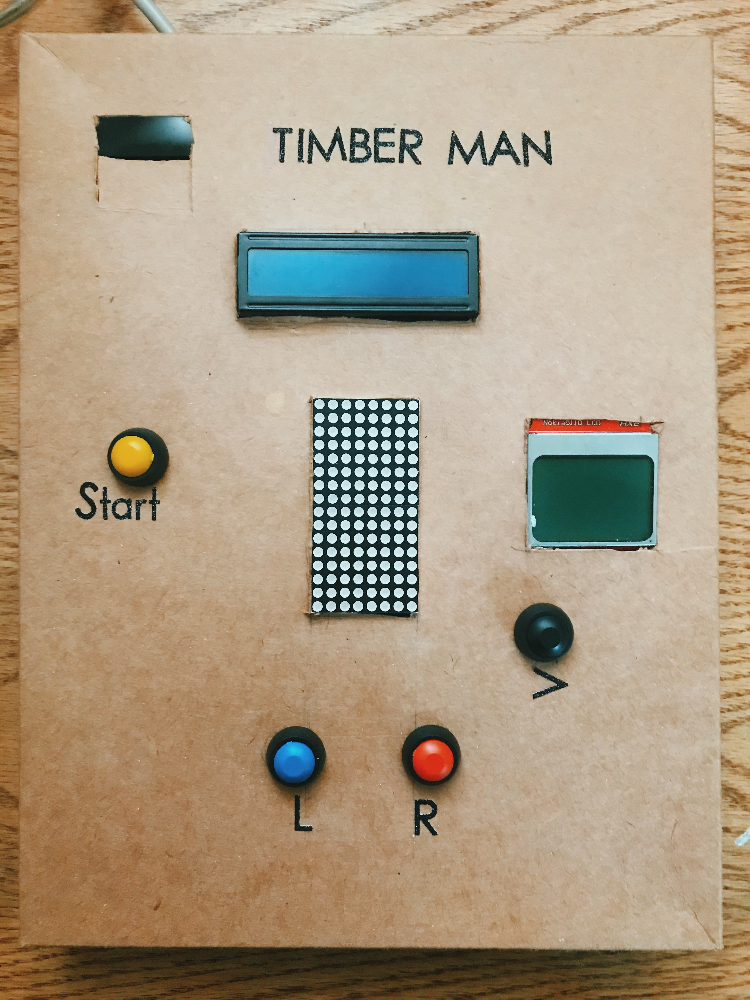
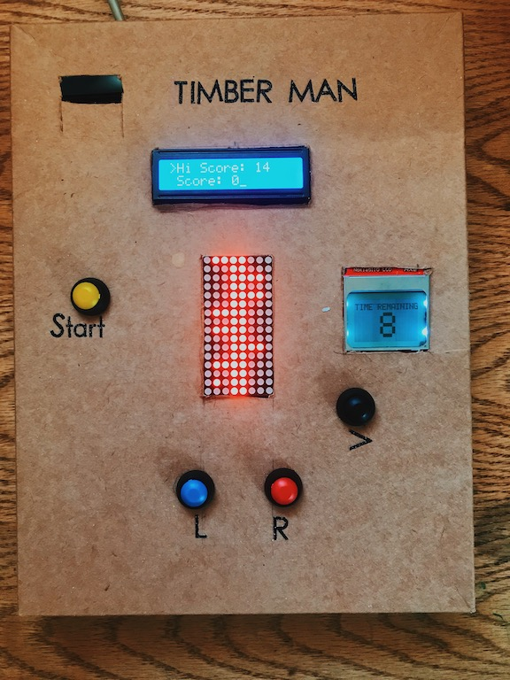

# Timber Man Variation

Timber Man is a game where you play as a Lumber Jack quickly chopping away at a tree. 
You are able to chop a piece of a huge tree trunk by either pressing the 
Right or Left buttons. At each chop ,the tree trunk gets cut, bringing down
branches with it. 

### The Task:

To cut as many pieces of the trunk without colliding with branches. You must
do so within a maximum 250ms time interval within each button press (chop). Failure to 
do so will result in a stop clock timer being decremented. The stopclock starts at 10
but if it decrements to 0, the game is ended. If Timber Man collides with a branch, he dies.   

Try to get a chopping high score! Good Luck! 

# Parts Used
  - 8x8 LED Matrix (2) MAX7219
  - Button Inputs (Start, Left, Right, Select)
  - LCD Display (Score)
  - Nokia 5110 LCD Display Module (Stopclock)
  - Piezo speaker buzzer
  - Cardboard box from Coffee Bean

Off             |  On
:-------------------------:|:-------------------------:
  |  

### Tech
The programming language used is C. Programming the ATmega1284 microcontroller using the AVR-toolchain.
The AVR® Toolchain is a collection of tools/libraries used to create applications for AVR microcontrollers. 

# Links

(1) Video Demonstration:
<a href="https://www.youtube.com/watch?v=E55vy712cMo">Youtube Video</a>

(2) Wiring & Documentation: 
<b href="https://docs.google.com/document/d/17xzWEt5Au0ppzZXw-lrA1UG9Mo49ktF5PW19VYaI-cI/edit?usp=sharing">Docs</b>

